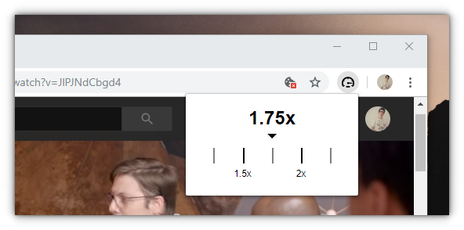

  <h1>Speed</h1>
  
✨📺 <i>A browser extension to control the speed of videos.</i> 📺✨

  

## 🎉 Installation

On Google Chrome:

- Clone or download this repository
- Open Google Chrome
- Go to `chrome://extensions/`
- Enable "Developer mode" option
- Click in "Load unpacked"
- Select the folder of this repository
- Enjoy it!

## 📃 License

MIT
